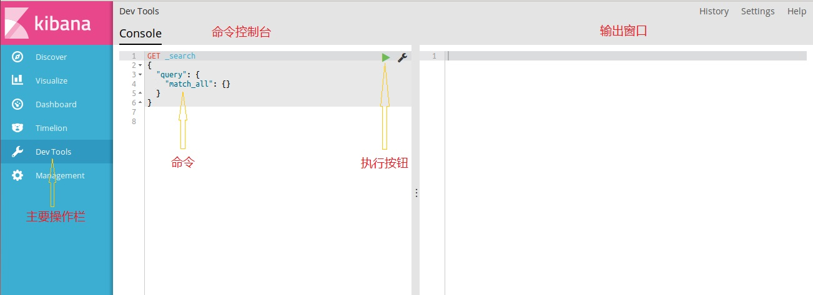

# Elasticsearch 安装与Demo运行

## Elasticsearch 介绍

Elasticsearch是一个基于Apache Lucene(TM)开源搜索引擎。无论在开源还是专有领域，其可以被认为是迄今为止最先进、性能最好的、功能最全的搜索引擎库之一。该引擎使用Java开发并使用Lucene作为其核心来实现所有索引和搜索的功能，但是它的目的是通过简单的RESTful API来隐藏Lucene的复杂性，从而让全文搜索变得简单。

## 初始环境设置

1. 建议配置变量之前首先改换阿里镜像apt源，方法可以参考 http://blog.csdn.net/jinguangliu/article/details/46539639

2. 安装java

   在终端中输入如下命令：
   
        $ sudo add-apt-repository ppa:webupd8team/java
        $ sudo apt-get update
        $ sudo apt-get install oracle-java8-installer
        
## 安装与配置

1. **安装包获取**

   在网站 https://www.elastic.co/downloads/elasticsearch 中可以获得最新的安装包，下载 `Tar` 包即可
   
   如果没有可视化界面，可以通过命令 
   
     `$ curl -L -O https://artifacts.elastic.co/downloads/elasticsearch/elasticsearch-$VERSION.tar.gz`
     
   来下载，笔者采用的 `$VERSION` 为 `5.5.0`
   
   接下来利用命令 `$ tar -xvf elasticsearch-5.5.0.tar.gz` 进行解压
   
2. **建立平台**

   下载解压好之后，进入安装包的 `bin` 文件夹中，输入如下命令启动搜索平台：
   
   `$ ./elasticsearch`
   
   如果没有异常信息，那么下面我们来测试 Elasticsearch 是否启动成功。可以在浏览器中访问 `localhost:9200` 或者打开另一个终端，执行以下命令 `$ curl 'http://localhost:9200/?pretty'`，均会看到类似于如下的一个json文本：
   
       {
         "name" : "d9bkHkE",
         "cluster_name" : "elasticsearch",
         "cluster_uuid" : "z_fZnxlnQ8S8fX4lnj2ozA",
         "version" : {
            "number" : "5.5.0",
            "build_hash" : "0424099",
            "build_date" : "2017-05-31T23:38:55.271Z",
            "build_snapshot" : false,
            "lucene_version" : "6.6.0"
          },
         "tagline" : "You Know, for Search"
        }
   
   这代表了你现在已经成功地启动并运行一个 Elasticsearch 节点了
   
## Demo 运行

Elasticsearch 提供了一个搜索的框架，能让我们调用网站（默认为localhost）的 API 进行各种操作，在终端下利用 `curl` 命令可以实现 API 的调用，以达到添加项、删除项、查找、条件查找等功能，具体的操作可以参考官方文档 https://www.elastic.co/guide/en/elasticsearch/reference/current/index.html

同时，elastic 也提供了一个可视化的系统 Kibana, 操作界面非常友好，下面我们尝试用 Kibana 来运行一个 demo.

1. **安装与部署**

   安装 Kibana 的过程和 Elasticsearch 非常类似，下载网址在 https://www.elastic.co/downloads/kibana. 解压后进入 `bin` 文件夹，执行命令 `./kibana` 即可。
   
   *注意，在运行 Kibana 之前首先要确保 Elasticsearch 处于工作状态*
   
   如果顺利运行，那么我们就可以在浏览器上访问 localhost:5601 进入 Kibana 的操作界面了，我们主要的操作在 `Dev Tools` 一栏的控制台中，如下所示：
   
   
   
2. **demo运行**

   为了更好地理解与应用 elasticsearch 的功能特性，我们以一个小的员工信息查询demo 为例，而不是列举繁琐的命令（命令可以通过官方文档轻松查到）。
   
   搭建好平台之后，进入 Kibana 控制台。首先使用以下命令将三个员工的信息录入系统中：
   
   *注：输入完命令后点击上方的绿色按钮执行*
   
       PUT /megacorp/employee/1
       {
           "first_name" : "John",
           "last_name" :  "Smith",
           "age" :        25,
           "about" :      "I love to go rock climbing",
           "interests": [ "sports", "music" ]
       }
       
       PUT /megacorp/employee/2
       {
           "first_name" : "Jane",
           "last_name" :  "Smith",
           "age" :        32,
           "about" :      "I like to collect rock albums",
           "interests": [ "music" ]
       }
       
       PUT /megacorp/employee/3
       {
           "first_name" : "Douglas",
           "last_name" :  "Fir",
           "age" :        35,
           "about" :      "I like to build cabinets",
           "interests": [ "forestry" ]
       }
       
   成功之后，我们可以任意执行 `GET /megacorp/employee/$n` 查询原始的员工数据（`$n` 代表第n个员工）
   
   接下来我们尝试用几种不同的搜索方式来获得自己想要的信息：
   
   **简单检索**
   
    命令 `GET /megacorp/employee/_search` 能够检索出库中所有的信息，默认显示前10个
   
    命令 `GET /megacorp/employee/_search?q=last_name:Smith` 在请求中依旧使用_search关键字，然后将查询语句传递给参数q=，这样就可以得到所有姓氏为Smith的结果（其他的参数亦类似）
   
   **DSL检索**
   
    DSL检索引入了json请求体，允许构建更加复杂、强大的查询
    
    如命令：
    
       GET /megacorp/employee/_search
       {
          "query" : {
              "match" : {
                  "last_name" : "Smith"
              }
          }
       }

    也可以实现查询 last_name 为 Smith 的员工信息。这样的查询方式更加灵活与精准（详细使用仍然请参考官方文档）
    
   **全文搜索**
   
    通过如下命令可以搜索到所有包含 “rock climbing” 相关字段的员工：
    
       GET /megacorp/employee/_search
       {
          "query" : {
               "match" : {
                   "about" : "rock climbing"
               }
           }
       }
       
   **短语搜索**
   
    与全文搜索不同，短语搜索适用于更加精准的场合，如以下命令可以严格检索到包含 “rock climbing” 字段的员工信息：
    
       GET /megacorp/employee/_search
       {
           "query" : {
               "match_phrase" : {
                   "about" : "rock climbing"
               }
           }
       }
       
       
